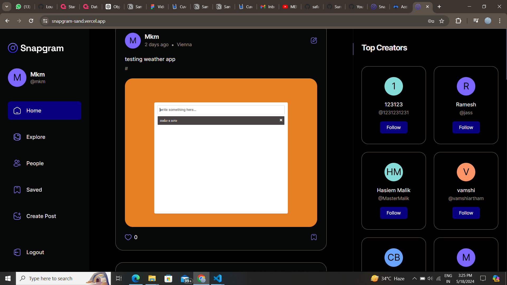

# Pixel-pals Social Media

# **Pixel-pals**



## **Live Demo**

Check out the live demo [here](https://snapgram-sand.vercel.app/)

## **Description**

## **Tech Stack**

- React
- React Context
- React Query
- Typescript
- Tailwind CSS
- Appwrite

## <a name="features">🔋 Features</a>

👉 **Authentication System**: A robust authentication system ensuring security and user privacy

👉 **Explore Page**: Homepage for users to explore posts, with a featured section for top creators

👉 **Like and Save Functionality**: Enable users to like and save posts, with dedicated pages for managing liked and saved content

👉 **Detailed Post Page**: A detailed post page displaying content and related posts for an immersive user experience

👉 **Profile Page**: A user profile page showcasing liked posts and providing options to edit the profile

👉 **Browse Other Users**: Allow users to browse and explore other users' profiles and posts

👉 **Create Post Page**: Implement a user-friendly create post page with effortless file management, storage, and drag-drop feature

👉 **Edit Post Functionality**: Provide users with the ability to edit the content of their posts at any time

👉 **Responsive UI with Bottom Bar**: A responsive UI with a bottom bar, enhancing the mobile app feel for seamless navigation

👉 **React Query Integration**: Incorporate the React Query (Tanstack Query) data fetching library for, Auto caching to enhance performance, Parallel queries for efficient data retrieval, First-class Mutations, etc

👉 **Backend as a Service (BaaS) - Appwrite**: Utilize Appwrite as a Backend as a Service solution for streamlined backend development, offering features like authentication, database, file storage, and more

and many more, including code architecture and reusability

## **How to Install**

1. **Clone the Repository:**

   ```bash
   git clone https://github.com/Mayankmishra110/PixelPals.git
   ```

2. **Install Dependencies:**

   ```bash
   cd Pixel-Pals
   npm install
   ```

3. **Configure Appwrite:**

   - Sign up or login to your Appwrite console
   - Create a new project and name it what ever you want (Ex. Pixel-pals)
   - Create a new Database and name it what ever you want (Ex. `Pixel-pals-db`)
   - Start Creating the following collections in `Pixel-pals-db`
     - **Saves**
       - add the following attributes
       | Propertie | Type               |
       | --------- | ------------------ |
       | user      | Relation with user |
       | post      | Relation with post |
     - Posts
       - add the following attributes
       | Propertie | Type                      |
       | --------- | ------------------------- |
       | creator   | Relationship with creator |
       | likes     | Relationship with likes   |
       | caption   | String                    |
       | tags      | String []                 |
       | imageUrl  | Url                       |
       | imageId   | String                    |
       | location  | String                    |
       | save      | Relationship with save    |
       - add the following indexes
       | key     | Type     | arttributes | asc/desc |
       | ------- | -------- | ----------- | -------- |
       | caption | fulltext | caption     | DESC     |
     - Users
       - add the following attributes
       | Propertie | Type                      |
       | --------- | ------------------------- |
       | creator   | Relationship with creator |
       | likes     | Relationship with likes   |
       | caption   | String                    |
       | tags      | String []                 |
       | imageUrl  | Url                       |
       | imageId   | String                    |
       | location  | String                    |
       | save      | Relationship with save    |
       - add the following indexes
       | key     | Type     | arttributes | asc/desc |
       | ------- | -------- | ----------- | -------- |
       | caption | fulltext | caption     | DESC     |

4. Add `.env.local` Variables

   ```
   VITE_APPWRITE_PROJECT_ID=
   VITE_APPWRITE_URL=
   VITE_APPWRITE_DATABASE_ID=
   VITE_APPWRITE_STORAGE_ID=
   VITE_APPWRITE_USER_COLLECTION_ID=
   VITE_APPWRITE_POST_COLLECTION_ID=
   VITE_APPWRITE_SAVES_COLLECTION_ID=
   ```

5. **Start the Development Server:**

   ```bash
   npm run dev
   ```

6. **Visit the App:**
   - Open your browser and navigate to **`[http://localhost:5173](http://localhost:5173)`** to see Pixel-pals in action.

## **Usage**

1. **Sign Up or Sign In:**
   - Create a new account or sign in with your existing credentials.
2. **Explore and Follow:**
   - Explore posts from other users and follow those you find interesting.
3. **Create and Like Posts:**
   - Share your moments by creating posts and interact with others by liking their posts.
4. **View and Save Posts:**
   - View your own and others' profiles, and save posts for future reference.
5. **Enjoy Pixel-pals:**
   - Have fun using Pixel-pals and connecting with other users in this social media experience!
